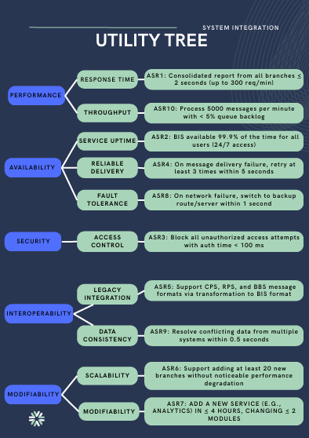

# Brokerage Information System (BIS)
Software Architecture Design & Quality Attribute Analysis

##  Project Overview
This project presents the architectural design of a Brokerage Information System (BIS) that integrates multiple legacy systems into a centralized platform.  
The system focuses on scalability, security, performance, and interoperability.

The project demonstrates structured architectural evaluation using scenario-based quality attribute analysis.

##  Architectural Approach
The system architecture was designed based on:

- Architecturally Significant Requirements (ASRs)
- Utility Tree Analysis
- Quality Attribute Prioritization
- Publisher-Subscriber Architectural Pattern
- Messaging Infrastructure Design

##  System Integration
The BIS integrates data from:

- CPS (Commercial Property System)
- RPS (Residential Property System)
- BBS (Billing & Contract System)

##  Quality Attributes Addressed
- Performance (≤ 2 seconds report generation under peak load)
- Security (Secure authentication and authorization)
- Availability (99.9% uptime)
- Interoperability (Legacy system integration)
- Modifiability (Support future system expansion)

##  Architectural Pattern
Publisher-Subscriber Pattern with a Message Broker to enable asynchronous communication and loose coupling between systems.

##  Project Artifacts
- Use Case Diagram
- Architecturally Significant Requirements (ASRs)
- Utility Tree
- Quality Attribute Analysis
- Messaging Infrastructure Design
- [Final Report](BIS-Software-Architecture-Report.pdf)
- [Presentation Slides](BIS-Software-Architecture-Presentation.pdf)

---

## My Contribution
- Led the development of the Utility Tree to prioritize and evaluate quality attributes.
- Designed and documented 10 architectural analysis tables covering key quality attribute scenarios.
- Analyzed performance, security, availability, interoperability, and modifiability trade-offs.
- Contributed to architectural decision-making based on structured quality attribute evaluation.

## Architectural Analysis Tables
The project includes 10 structured analysis tables that evaluate:
- Quality attribute scenarios
- Priority levels
- Risk assessment
- Trade-off analysis
- Architectural impact

These tables were developed to support data-driven architectural decisions.

## Utility Tree
The system architecture was evaluated using a structured Utility Tree to prioritize quality attributes such as performance, availability, security, interoperability, and modifiability.

---

## Sample Architectural Analysis Tables

### Security (ASR2)

### Interoperability (ASR4)

---

 University of Jeddah  
 Course: Software Architecture  
 Author: Toleen Wael
